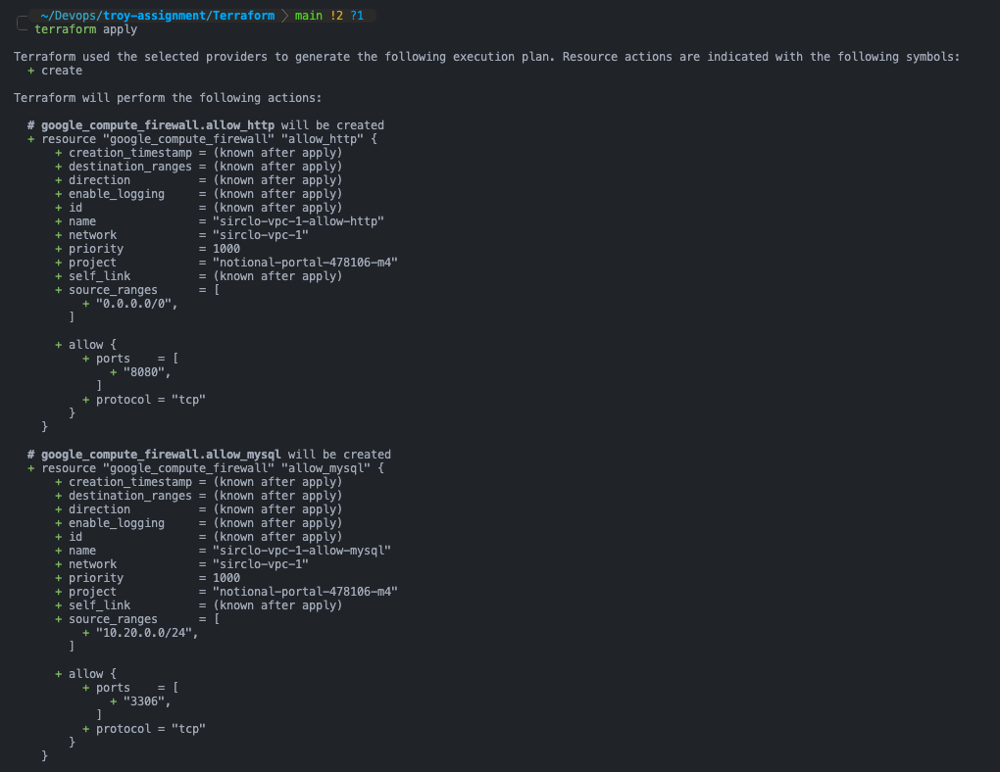
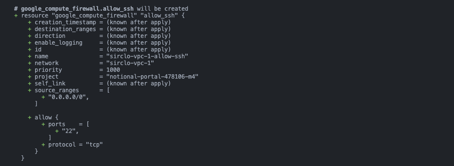
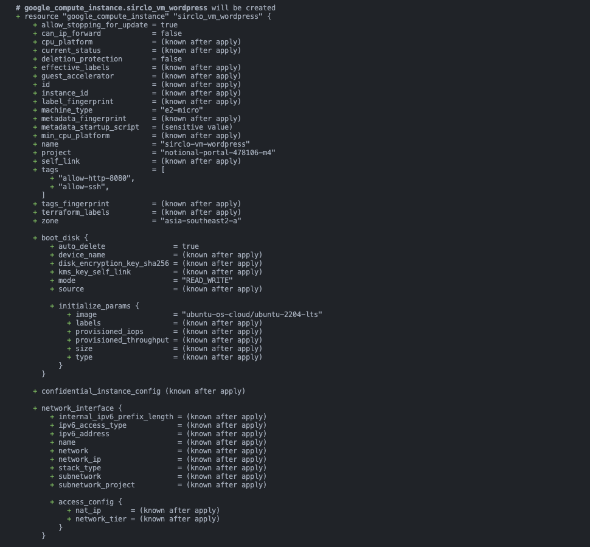
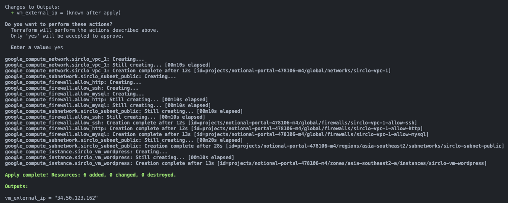
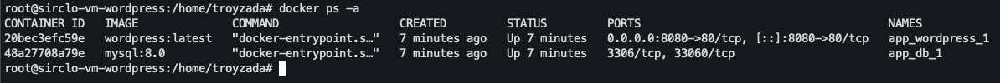
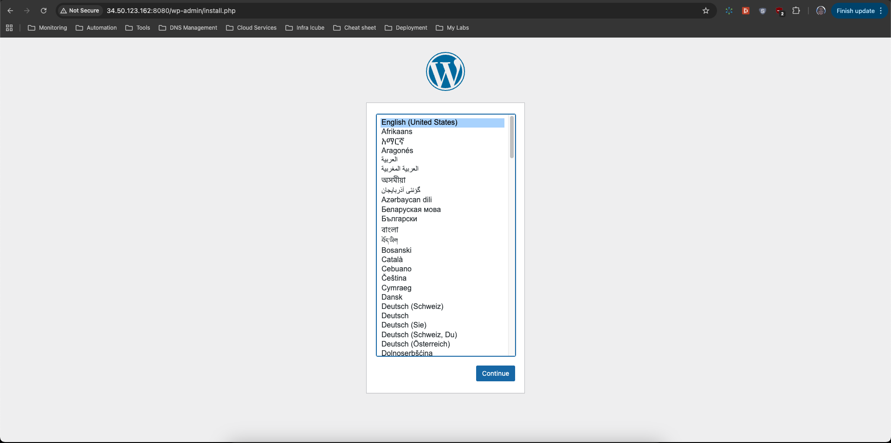
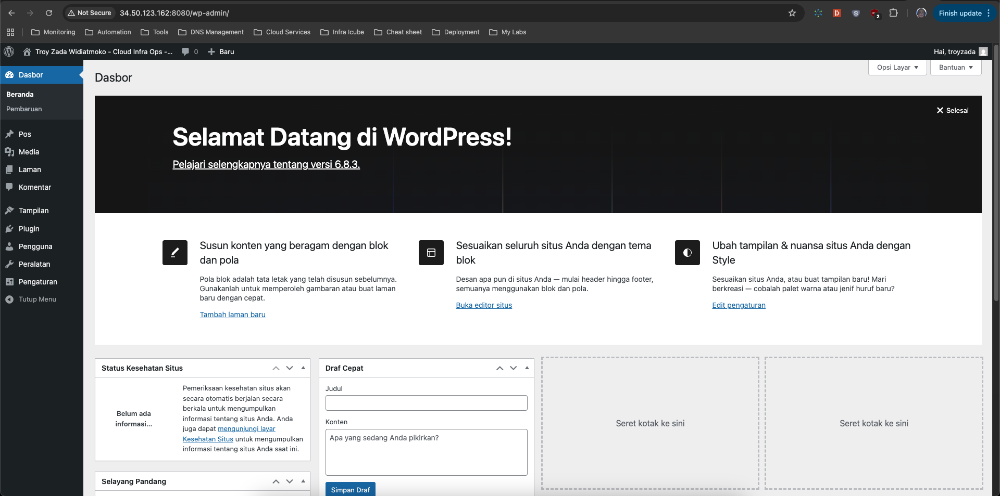
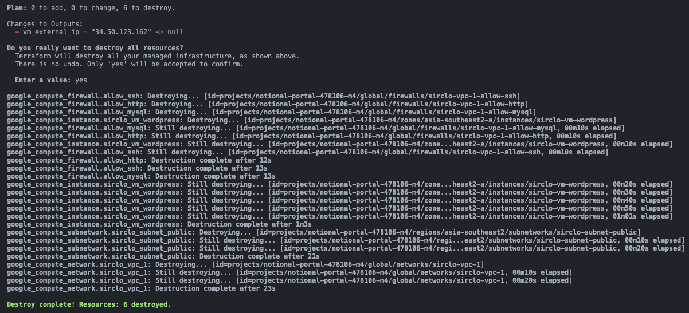

# Automated WordPress Deployment on GCP with Terraform

This project provides a fully automated deployment for a WordPress site on Google Cloud Platform (GCP). It uses Terraform to provision the infrastructure (VPC, VM, Firewall) and Docker Compose to run the application (WordPress & MySQL).

The entire process, from a single `terraform apply` command to a live WordPress site, is 100% automated via the VM's startup script.

---

## 📂 Submission Structure

This repository is structured to meet the assignment requirements:
```bash
/troy-assignment/
├── app/
│   ├── .env.example
│   └── docker-compose.yml
├── images/
├── terraform/
│   ├── instance.tf
│   ├── main.tf
│   ├── secgroup.tf
│   ├── startup-script.sh.tftpl
│   ├── variables.tf
│   └── vpc.tftpl
├── .gitignore
└── README.md
```

---

## Explanation of Each File/Folder

* **`app/`**: Contains all application-related files for **Task 2**.
    * `docker-compose.yml`: Defines the `db` (MySQL) and `wordpress` services, their networking, and volumes.
    * `.env.example`: A template file showing the required environment variables (like database passwords) needed by `docker-compose`.

* **`images/`**: Holds all screenshots used in this `README.md` for documentation and verification.

* **`terraform/`**: Contains all the modular Infrastructure as Code (IaC) files for **Task 1**.
    * `main.tf`: The main entrypoint that configures the Google Cloud provider.
    * `variables.tf`: Declares all input variables (e.g., `gcp_project_id`, `git_repo_url`, `mysql_password`).
    * `instance.tf`: Defines the GCP Compute Engine VM (`e2-micro`), including its OS image and network interface.
    * `secgroup.tf`: Defines the firewall rules (equivalent to Security Groups) to allow ports 22 (SSH) and 8080 (App).
    * `vpc.tf`: Defines the custom VPC and public subnet for the application.
    * `startup-script.sh.tftpl`: A *template* for the VM's startup script. Terraform injects secrets into this file to automate the `git clone` and `docker-compose up` process.

* **`.gitignore`**: A critical security file that tells Git to **ignore** sensitive files like `terraform.tfvars`, `app/.env`, and local state files (`*.tfstate`).

* **`README.md`**: This documentation file for **Task 3**, explaining the project's purpose, setup, and how to run, verify, and clean up the deployment.

---

### Prerequisites

The following software must be installed on your local machine to run this code:
* [Terraform](https://developer.hashicorp.com/terraform/downloads) (CLI)
* [Google Cloud SDK](https://cloud.google.com/sdk/docs/install) (`gcloud` CLI)

---

### Configuration

To set up your cloud credentials and project secrets, follow these steps:

1.  **Authenticate GCP Account:**
    Log in to `gcloud` and set up Application Default Credentials (ADC). Terraform will automatically use these credentials.
    ```bash
    gcloud auth login
    gcloud auth application-default login
    ```

2.  **Set Active Project:**
    Replace `[YOUR_PROJECT_ID]` with your GCP Project ID.
    ```bash
    gcloud config set project [YOUR_PROJECT_ID]
    gcloud config set compute/region asia-southeast2
    gcloud config set compute/zone asia-southeast2-a
    ```

3.  **Enable Required APIs:**
    ```bash
    gcloud services enable compute.googleapis.com
    gcloud services enable cloudresourcemanager.googleapis.com
    ```

4.  **Create Secret Variables File:**
    Inside the `terraform/` folder, create a new file named `terraform.tfvars`.
    > **Important:** This file contains secrets and is already listed in `.gitignore` to prevent it from being uploaded to Git.

5.  **Fill in `terraform.tfvars`:**
    Copy the content below into `terraform/terraform.tfvars` and fill in your values:

    ```bash
    # Replace with your PUBLIC Git repository URL
    git_repo_url = "https://github.com/troyzada/troy-assignment.git"

    # --- Database Secrets ---
    # The startup-script.sh.tftpl script will create a .env file on the VM using these values
    mysql_database      = "db_wordpress"
    mysql_user          = "wpuser"
    mysql_password      = "ChangeMeToARealPassword"
    mysql_root_password = "ChangeMeToARealRootPassword"
    ```

---

### Deployment Steps

To deploy the infrastructure and application, run the following commands:

1.  Change to the Terraform directory:
    ```bash
    cd terraform
    ```

2.  Initialize Terraform to download providers:
    ```bash
    terraform init
    ```

3.  **(Optional but Recommended)** Review the execution plan:
    ```bash
    terraform plan
    ```

4.  Apply the configuration to create everything:
    ```bash
    terraform apply
    ```
    Type `yes` when prompted to confirm.

    
    
    
    
    

---

### Verification

To check if the deployment was successful:

1.  **Check Terraform Output:**
    After `terraform apply` finishes, you will see an output in your terminal, like this:

    ```
    Outputs:
    vm_external_ip = "34.50.123.162"
    ```

2.  **Wait 2-3 Minutes:**
    Allow time for the VM's startup script to finish (installing Docker, cloning, and downloading images).

    You can also log in to the VM to confirm the Docker services are running.
    * **SSH into the VM:** Use the `gcloud` command and your VM's name.
        ```bash
        gcloud compute ssh sirclo-vm-wordpress --zone asia-southeast2-a
        ```
    * **Check Services:** Once inside, navigate to the app directory and check the `docker-compose` status.
        ```bash
        cd /srv/app/app
        docker-compose ps
        ```
    * You should see both the `db` and `wordpress` services running with a `State` of `Up`.

    

3.  **Open Your Browser:**
    Open a web browser and navigate to the IP you received, on port 8080.
    `http://34.50.123.162:8080`

    If successful, you will see the WordPress installation screen, proving the deployment worked.

    

4. **Setup WordPress:**

    
    

---

### Cleanup

To destroy all infrastructure created in GCP and stop all billing:

1.  Ensure you are in the `terraform/` directory.
2.  Run the `destroy` command:

    ```bash
    terraform destroy
    ```

    Type `yes` when prompted to confirm.

    
    

--- 